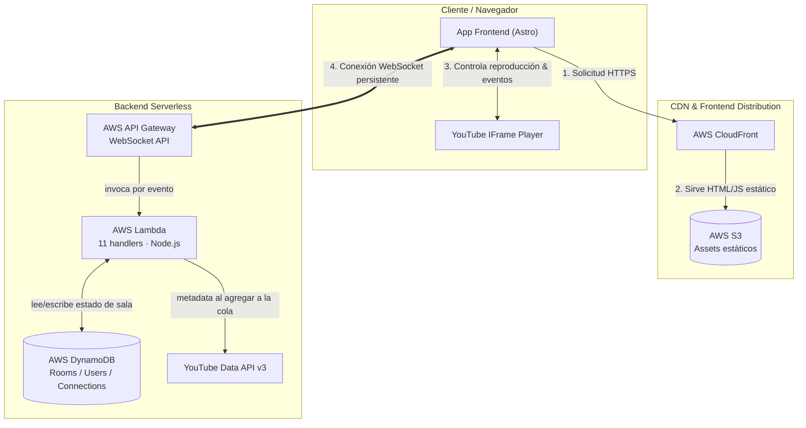

# smol-tube

Watch party serverless: sincroniza reproducción de YouTube, chat y control de sala entre varios usuarios, sin ningún servidor corriendo cuando nadie la está usando.

Proyecto personal construido desde cero (sin frameworks de watch-party existentes) como ejercicio de arquitectura serverless en AWS: WebSockets persistentes vía API Gateway, cómputo bajo demanda en Lambda, y estado compartido efímero en DynamoDB con TTL — cero costo de cómputo en reposo.

## Cómo funciona

Un único servidor Node + Socket.IO cubre el mismo contrato de eventos para desarrollo local rápido, sin tocar AWS. La lógica de negocio (permisos por rol, reglas de quién puede controlar la reproducción, moderación) vive en un paquete de dominio puro, sin ninguna dependencia de Socket.IO ni del SDK de AWS — el mismo código corre en ambos adapters.

## Stack

- **Backend serverless**: API Gateway (WebSocket API) + 11 funciones Lambda + DynamoDB (3 tablas, TTL habilitado), desplegado con AWS SAM.
- **Backend local**: Node.js + Socket.IO + Express, mismo contrato de eventos.
- **Frontend**: Astro + TypeScript, sin framework de componentes — desplegado como sitio estático en S3 + CloudFront.
- **Dominio**: paquete TypeScript aislado con las reglas de negocio (roles, permisos, control de reproducción, moderación), compartido entre ambos backends.
- **Monorepo**: pnpm workspaces (`domain`, `backend`, `frontend`).
- **CI/CD**: GitHub Actions — lint, typecheck y tests en cada PR; despliegue automático a AWS al hacer merge a `main`, separado por paquete (el backend solo se redespliega si cambió `packages/backend/`, igual el frontend).

## Diseño

- **Roles y permisos explícitos**: invitado, moderador y administrador, con una tabla de permisos por rol en vez de jerarquía calculada — fácil de auditar, fácil de testear.
- **Autoridad de reproducción**: un único "leader" por sala controla qué se reproduce y en qué punto del tiempo; el resto de clientes se sincroniza a ese estado.
- **Sin persistencia real**: nada sobrevive más allá de la sesión activa — TTL nativo de DynamoDB en producción, memoria de proceso en desarrollo local. No hay base de datos relacional en ningún punto del sistema.
- **Dos adapters, un dominio**: el mismo conjunto de reglas de negocio se prueba una vez y se reutiliza tanto en el servidor Socket.IO local como en los handlers de Lambda, sin duplicar lógica entre ambos.

## Estado del proyecto

El flujo central (autenticación, salas, chat, sincronización de reproducción, moderación, cola de reproducción) está implementado y desplegado de punta a punta en AWS. Cobertura de tests aún parcial — es la siguiente mejora planeada, junto con reconciliación más fina de drift de reproducción.
